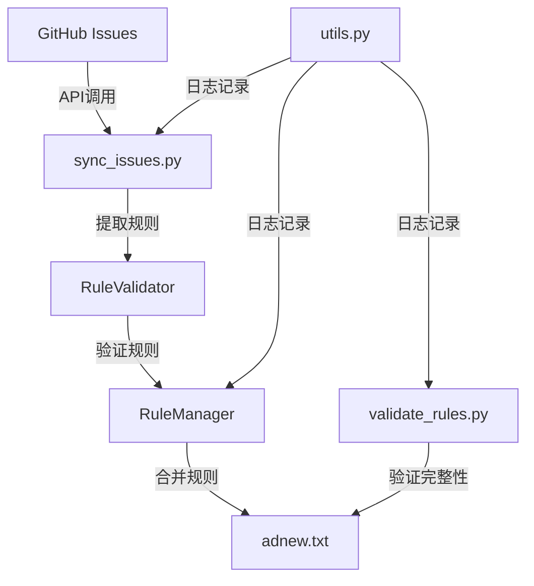

## 用户需求

查看整个AdSuper项目，识别需要优化的点和需要修复的bug。

## 产品概述

AdSuper是一个社区驱动的广告规则收集与管理平台，使用Python编写，通过GitHub Issues收集规则，自动验证、合并和发布广告过滤规则。

## 核心功能

- 从GitHub Issues自动提取广告过滤规则
- 验证规则格式的正确性
- 检测规则冲突
- 合并新规则与现有规则
- 生成合并后的规则文件
- 验证规则完整性

## 技术栈

- 编程语言: Python 3
- 核心依赖: PyGithub, requests, python-dateutil
- 正则表达式引擎: Python re模块
- GitHub API交互: PyGithub库和requests库

## 实现方法

### 1. 修复正则表达式模式问题

**策略**: 重新设计并优化规则匹配的正则表达式
**原因**: 当前正则表达式存在模式不匹配、不支持多域名规则、错误转义等问题
**具体方案**:

- 修复DOMAIN规则正则: `r'^\|\|[^\s^]+(\^|\$)'` → 正确匹配`||domain^`或`||domain$option`
- 修复ELEMENT规则正则: 支持多域名格式 `domain1,domain2##selector`
- 修复NETWORK规则正则: 正确识别网络请求规则
- 优化`extract_rules_from_issue`函数中的正则表达式模式

**性能考虑**: 预编译正则表达式，避免重复编译开销

### 2. 优化GitHub API调用

**策略**: 在API层面进行过滤，减少不必要的数据传输和处理
**原因**: 当前获取所有已关闭的issues后在本地过滤标签，效率低下
**具体方案**:

- 使用GitHub API的标签过滤参数
- 添加认证信息到`validate_rules.py`中的API调用
- 实现分页处理，支持大量issues的场景

**性能考虑**: 减少API调用次数，降低速率限制风险

### 3. 改进冲突检测算法

**策略**: 使用哈希表优化冲突检测，将O(n²)算法优化为O(n)
**原因**: 当前双重循环检查冲突，对于大量规则性能较差
**具体方案**:

- 按规则类型分组处理
- 使用字典记录例外规则和普通规则的映射关系
- 只检查可能的冲突组合，而非全组合

**性能考虑**: 时间复杂度从O(n²)降低到O(n)

### 4. 修复代码缺陷

**策略**: 修复参数传递错误、逻辑顺序错误等问题
**具体方案**:

- 修复`rule_manager.py`第40行: 添加缺失的`source`参数
- 修复注释规范化逻辑: 在去重检查之前执行规范化
- 使文件名可配置: 将硬编码的`'adnew.txt'`改为可配置参数

### 5. 增强日志功能

**策略**: 实现分级日志系统，支持文件输出
**具体方案**:

- 添加日志级别(DEBUG, INFO, WARNING, ERROR)
- 支持日志文件输出
- 添加日志格式化
- 保持向后兼容性

### 6. 固定依赖版本

**策略**: 在requirements.txt中指定依赖版本范围
**原因**: 避免不同环境下行为不一致
**具体方案**:

- PyGithub==1.59.1
- requests>=2.31.0
- python-dateutil>=2.8.2

## 实现说明

### 性能优化

- 正则表达式预编译: 避免重复编译开销
- 冲突检测算法优化: O(n²) → O(n)
- API调用优化: 减少不必要的数据传输

### 可靠性保障

- 向后兼容性: 保持现有API接口不变
- 错误处理: 添加适当的异常处理
- 日志记录: 增强问题诊断能力

### 代码设计合理性

- DRY原则: 复用`RuleValidator`类，避免代码重复
- 单一职责: 每个函数/类只做一件事
- 可配置性: 避免硬编码，提高灵活性

## 架构设计

### 系统架构图



### 模块关系

- `sync_issues.py`: 主脚本，协调各模块工作
- `scripts/rule_validator.py`: 规则验证器，提供规则验证、冲突检测、排序等功能
- `scripts/rule_manager.py`: 规则管理器，负责规则的加载、合并、保存
- `scripts/validate_rules.py`: 规则完整性验证工具
- `scripts/utils.py`: 工具函数，提供统一的日志输出

## 目录结构

```
AdSuper/
├── sync_issues.py            # [MODIFY] 主脚本：优化API调用，修复正则表达式
├── scripts/
│   ├── __init__.py          # [MODIFY] 包初始化文件
│   ├── rule_validator.py     # [MODIFY] 修复正则表达式模式，优化冲突检测算法
│   ├── rule_manager.py       # [MODIFY] 修复参数传递错误，使文件名可配置
│   ├── utils.py              # [MODIFY] 增强日志功能，支持分级日志和文件输出
│   └── validate_rules.py     # [MODIFY] 添加API认证，复用RuleValidator类
├── requirements.txt           # [MODIFY] 固定依赖版本
├── adnew.txt                 # [CHECK] 检查与AdSuper.txt的一致性
└── AdSuper.txt               # [CHECK] 检查与adnew.txt的一致性
```

## 关键代码结构

### RuleValidator类（修改后）

```python
class RuleValidator:
    def __init__(self):
        # 修复后的正则表达式模式
        self.patterns = {
            RuleType.DOMAIN: re.compile(r'^\|\|[^\s^]+(\^|\$.*)$'),
            RuleType.ELEMENT: re.compile(r'^([\w.-]+,)*[\w.-]+##.+$'),
            # ... 其他模式
        }
    
    def check_conflicts(self, rules: List[Rule]) -> List[Tuple[Rule, Rule, str]]:
        """优化后的冲突检测算法 O(n)"""
        exception_rules = {}
        normal_rules = {}
        
        # 按类型分组
        for rule in rules:
            if rule.type == RuleType.EXCEPTION:
                key = rule.content[2:]  # 移除@@前缀
                exception_rules[key] = rule
            else:
                normal_rules[rule.content] = rule
        
        # 检查冲突
        conflicts = []
        for content, normal_rule in normal_rules.items():
            if content in exception_rules:
                conflicts.append((exception_rules[content], normal_rule, f"规则冲突: {exception_rules[content].content} 和 {normal_rule.content}"))
        
        return conflicts
```

### 日志工具（增强后）

```python
import logging
from datetime import datetime

def setup_logging(level=logging.INFO, log_file=None):
    """配置日志系统"""
    logger = logging.getLogger('adsuper')
    logger.setLevel(level)
    
    # 控制台处理器
    console_handler = logging.StreamHandler()
    console_handler.setLevel(level)
    
    # 文件处理器（可选）
    if log_file:
        file_handler = logging.FileHandler(log_file, encoding='utf-8')
        file_handler.setLevel(level)
        logger.addHandler(file_handler)
    
    logger.addHandler(console_handler)
    return logger

def log(message: str, level: str = "INFO"):
    """统一日志输出（增强版）"""
    timestamp = datetime.now().strftime('%Y-%m-%d %H:%M:%S')
    print(f"[{timestamp}] [{level}] {message}")
```